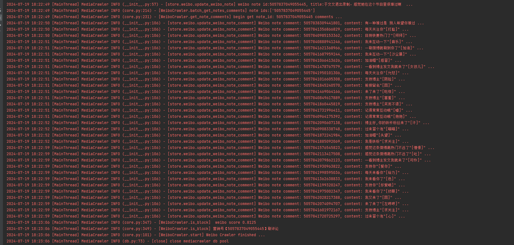
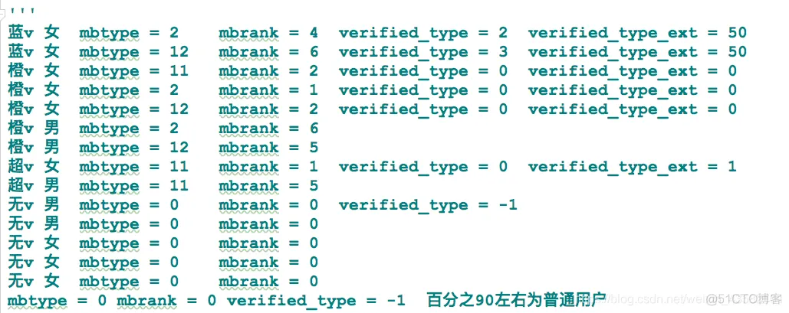

# 改动目标
- 利用mediacrawler框架中weib框架作为数据来源
- 爬取微博数据,根据微博(评论\赞\转发)等参数进行黑名单判定
- AI舆情接口,自动判断营销号
- 自动化流程


# 实施过程
## 关键步骤
- 登录上下文直接套用mediacrawler,不重复造轮子了
> login_by_qrcode

- 寻找目标
> 打算对热门微博进行轮询&热搜榜单上固定寻找目标

````
#https://s.weibo.com/top/summary?cate=realtimehot
async def get_top(self) -> List[Dict]:
    uri = "/api/container/getIndex"
    params = {"containerid": "106003&filter_type=realtimehot"}
    return await self.get(uri, params=params)
````
-添加判断模型


# 微博API接口
- 用户主页信息
```https://m.weibo.cn/api/container/getIndex?type=uid&value={6601716410}```
1. data.userInfo.followers_count 粉丝数量 例 "19.4万" str
2. data.userInfo.toolbar_menus[0].userInfo.verified 是否认证 bool
3. data.userInfo.toolbar_menus[0].userInfo.verified_type 认证类型  int


```https://m.weibo.cn/api/container/getIndex?type=uid&value=5716177894&containerid={}```
- containerid从上面接口获取
data.tabsInfo.tabs
```
[
    {
        "id": 1,
        "tabKey": "profile",
        "must_show": 1,
        "hidden": 0,
        "title": "精选",
        "tab_type": "profile",
        "containerid": "2302836601716410"
    },
    {
        "id": 2,
        "tabKey": "weibo",
        "must_show": 1,
        "hidden": 0,
        "title": "微博",
        "tab_type": "weibo",
        "containerid": "1076036601716410",
        "apipath": "/profile/statuses",
        "headSubTitleText": "全部微博(7907)",
        "new_select_menu": 1,
        "gender": "f",
        "params": {
            "new_select_menu": 1,
            "gender": "f"
        },
        "tab_icon": "https://h5.sinaimg.cn/upload/1059/799/2021/04/01/weibotab.png",
        "tab_icon_dark": "https://h5.sinaimg.cn/upload/1059/799/2021/04/07/weibotab_dark.png",
        "url": "/index/my"
    },
    {
        "id": 4,
        "tabKey": "original_video",
        "must_show": 0,
        "hidden": 0,
        "title": "视频",
        "tab_type": "video",
        "containerid": "2315676601716410"
    },
    {
        "id": 10,
        "tabKey": "album",
        "must_show": 0,
        "hidden": 0,
        "title": "相册",
        "tab_type": "album",
        "containerid": "1078036601716410",
        "filter_group": [
            {
                "name": "图片墙",
                "containerid": "1078036601716410",
                "title": "图片墙",
                "scheme": ""
            },
            {
                "name": "头像专辑",
                "containerid": "1078036601716410_42620729249433180000006601716410_-_albumeachCard",
                "title": "头像专辑",
                "scheme": ""
            },
            {
                "name": "相册专辑",
                "containerid": "1078036601716410_-_albumlist",
                "title": "相册专辑",
                "scheme": ""
            }
        ],
        "filter_group_info": {
            "title": "全部照片(11955)",
            "icon": "http://u1.sinaimg.cn/upload/2014/06/10/userinfo_icon_album.png",
            "icon_name": "专辑",
            "icon_scheme": ""
        }
    }
]
```
- 获取对应containerid微博内容,这这里取"containerid": "1076036601716410"

```https://m.weibo.cn/api/container/getIndex?containerid={containerid}_-_WEIBO_SECOND_PROFILE_WEIBO```


